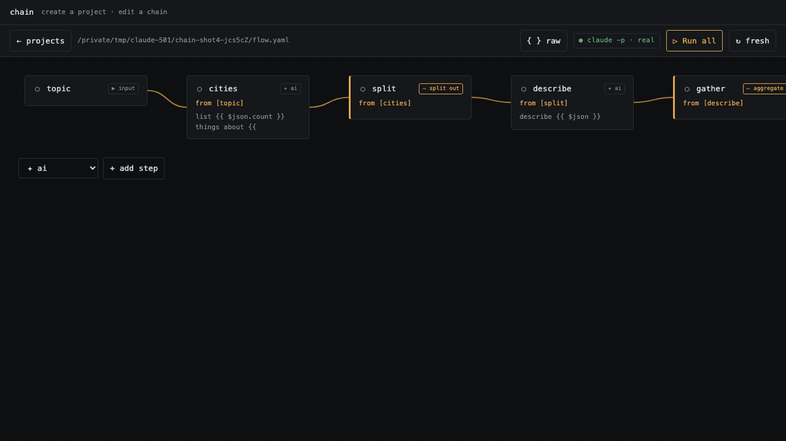

# chainq

**Run multi-step prompt chains on your local CLI models** (`claude -p`, `codex -m`) —
one YAML file, no API key, no HTTP. Drive it from the terminal or a visual editor.



## Quickstart

```bash
npx @wahengchang2023/chainq init my-flow    # scaffold a project
cd my-flow
npx @wahengchang2023/chainq ui flow.yaml    # open the visual editor
npx @wahengchang2023/chainq run flow.yaml   # …or run it in the terminal
```

Prefer a permanent command? `npm i -g @wahengchang2023/chainq`, then call **`chainq`**.
Needs **Node ≥ 18**. `ai` steps call your real local model — run `claude login` first.

## What it is

A flow is a small graph of steps in **one YAML file**. Each step is `ai` (calls the
model), `cmd` (a shell command), or a data op (`splitOut` · `aggregate` · `merge` ·
`assemble` · `write`). Wire them, run them, tune one prompt at a time.

- **CLI** — `chainq init · new · run · validate · ls`. `run` re-runs everything by
  default; add `--cache` to reuse unchanged steps.
- **Visual editor** (`chainq ui`) — canvas with drag-to-connect, insert-a-step-on-a-wire,
  per-node type switching, and live invalid-wiring warnings. Binds to `127.0.0.1` only.

## Docs

| You want to… | Go to |
|---|---|
| Go from zero to running, step by step | [Getting started](docs/getting-started.md) |
| Look up a command or flow field | [CLI reference](docs/cli/reference.md) |
| Follow a hands-on walkthrough | [Tutorial](docs/cli/tutorial.md) · [How-to](docs/cli/how-to.md) |
| Understand *why* it works this way | [Explanation](docs/cli/explanation.md) |
| Clear up common confusions (input vs `from`, schema…) | [FAQ](docs/faq/FAQ.md) |
| Copy a working example flow | [Scenarios](docs/scenario/) · [examples/](examples/) |
| Read design notes and internals | [docs/design.md](docs/design.md) |
| See what changed | [CHANGELOG](CHANGELOG.md) |

## Security

`chainq` runs local models you already trust; every subprocess is spawned with an argv
array, never a shell string (no command injection). `chainq ui` binds to `127.0.0.1`
on a random port — **don't expose it to an untrusted network.**

## License

[MIT](LICENSE) © wahengchang
