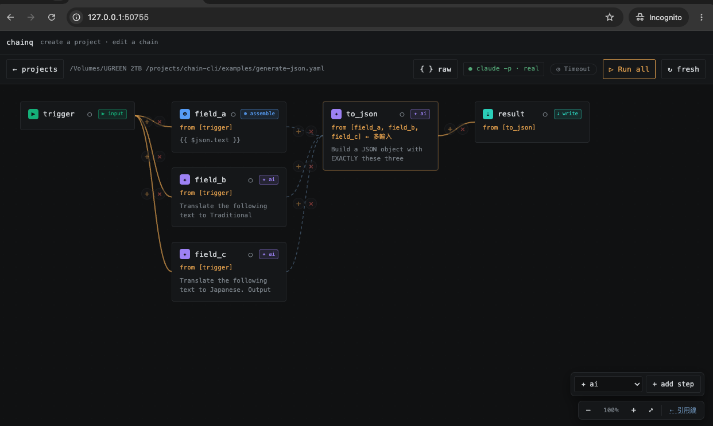

# chainq

**Prompt chaining for people who live in prompts — not in dashboards.**

Wire a few prompts together, run them on the CLI model you already have
(`claude -p`, `codex -m`), and watch every step light up **on the same canvas you
built it on**. One YAML file. No API key. No HTTP. No server to host.



## Why chainq

You chain prompts all day — translate then format, draft then critique, extract
then assemble. But the tools for "automating" that are built for a different job:

| | n8n · Make · Zapier | **chainq** |
|---|---|---|
| Where it runs | a server / their cloud | **your machine, your CLI model** |
| Credentials | API keys, OAuth, billing | **none — `claude login` and go** |
| Editing vs. running | build here, check the run log *over there* | **same canvas — edit it, run it, see it** |
| The artifact | a config locked in their UI | **one YAML file you own and `git` it** |
| Learning curve | a node ecosystem | **5 node types, one page** |

If you've ever thought *"this is just three prompts in a row, why do I need a
whole platform?"* — that's the gap chainq fills.

## The one thing that's different: edit and run are the same screen

In most automation tools you build a flow, push it to run somewhere, then open a
separate "executions" view to see what happened. In chainq there is no over-there.

The canvas you wire is the canvas that runs. Hit **Run** and each node streams its
own status live — `running → ran / cached / failed` — with its real output rendered
right on the node card. Tweak one prompt, re-run **without even saving** (your edit
is kept as a draft; the file stays untouched until you Save or ↩ Reset), and tune
one step at a time until the whole chain is right.

That's the loop: **see the flow, run the flow, read the result — in one place.**

## Quickstart

```bash
npm i -g @wahengchang2023/chainq    # install once, get the `chainq` command
chainq init my-flow && cd my-flow   # scaffold a runnable starter flow
chainq ui flow.yaml                 # open the editor — edit + run on one canvas
```

Tune your flow on the canvas, then run it from the terminal to land the output —
same YAML, no extra export step:

```bash
chainq run flow.yaml    # run the whole flow; output lands in the file your write step names
```

Needs **Node ≥ 18**. `ai` steps call your real local model — run `claude login` first.
No global install? Swap `chainq` for `npx @wahengchang2023/chainq` in any command.

## What a flow looks like

A flow is a small graph of steps in **one YAML file**. Here a trigger fans out to a
few steps, then `ai + schema` assembles them into guaranteed-valid JSON and `write`
saves it — the whole thing readable top to bottom:

```yaml
steps:
  trigger:                       # input — the data to feed in
    type: input
    params:
      text: { type: string, default: 'The early bird catches the worm.' }

  field_a:                       # assemble — carry the original value through, no model call
    type: assemble
    from: trigger
    prompt: '{{ $json.text }}'

  field_b:                       # ai — call the model for one value
    type: ai
    from: trigger
    prompt: 'Translate to Traditional Chinese, output only the translation: {{ $json.text }}'

  to_json:                       # ai + schema — output is parsed & validated as real JSON
    type: ai
    from: [field_a, field_b]
    schema: { original: string, zh_tw: string }
    prompt: |
      Build a JSON object copying each value verbatim:
        original: {{ $('field_a') }}
        zh_tw:    {{ $('field_b') }}

  result:                        # write — land it as a file
    type: write
    from: to_json
    path: out/result.json
```

Every step is one of **5 node types**: `ai` (calls the model), `cmd` (a shell
command), `assemble` (reshape / combine items), `input` (the trigger), or
`write` (save a file). Full runnable version:
[`examples/generate-json.yaml`](examples/generate-json.yaml).

## How you drive it

- **Visual editor** (`chainq ui`) — drag-to-connect, insert-a-step-on-a-wire, switch a
  node's type in place, marquee-select, Space-to-pan, double-click to edit. Data-flow
  wires (the `$json` main input) and **reference wires** (`$('id')` cross-step lookups,
  even several steps back) read distinctly — warm-solid vs. cool-dashed, toggle to hide
  references. Give a slow step room with a per-node ◷ timeout so a long `ai` run isn't
  killed mid-flight. Binds to `127.0.0.1` only.
- **CLI** — `chainq init · new · run · validate · ls`. `run` re-runs everything by
  default; add `--cache` to reuse unchanged steps.

## Docs

| You want to… | Go to |
|---|---|
| Go from zero to running, step by step | [Getting started](docs/getting-started.md) |
| Look up a command or flow field | [CLI reference](docs/cli/reference.md) |
| Follow a hands-on walkthrough | [Tutorial](docs/cli/tutorial.md) · [How-to](docs/cli/how-to.md) |
| Understand *why* it works this way | [Explanation](docs/cli/explanation.md) |
| Clear up common confusions (input vs `from`, schema…) | [FAQ](docs/faq/FAQ.md) |
| Copy a working example flow | [Scenarios](docs/scenario/) · [examples/](examples/) |
| Read design notes and internals | [docs/design.md](docs/design.md) |
| See what changed | [CHANGELOG](CHANGELOG.md) |

## Security

`chainq` runs local models you already trust; every subprocess is spawned with an argv
array, never a shell string (no command injection). `chainq ui` binds to `127.0.0.1`
on a random port — **don't expose it to an untrusted network.**

## License

[MIT](LICENSE) © wahengchang
